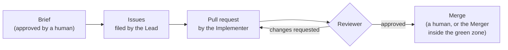

# Kanon

[](https://github.com/yedeya-labs/kanon/actions/workflows/ci.yml)
[](https://github.com/yedeya-labs/kanon/releases)
[](LICENSE)

**An opinionated agentic development workflow for GitHub and Claude Code.** AI agents file, implement and review the work on your repository, under rules that fail the build, not settings that can be switched off.

> **κανών** (*kanōn*): a measuring rod; the rule that work is checked against.

## Why Kanon

Running AI agents in GitHub Actions is a solved problem. What isn't solved is everything around it: what an agent may decide on its own, what counts as done, who has the last word, and how you find out when it went wrong. Kanon is that governance, written down and enforced.

- **Specs as acceptance criteria.** Behaviour is stated once, as a numbered invariant, and every issue's acceptance criteria cite it. "Done" means those invariants pass, not that an agent says so.
- **Review until approval, then a human merges.** An adversarial reviewer agent reviews every PR until it approves. An agent only merges inside a narrow green zone the project defines, and anything on an escalation path always goes to a human.
- **One taxonomy for work.** Labels, severities and milestone kinds are fixed, with a clear line between what an agent may decide and what a human must.
- **Cost and signal discipline.** Anything that raises cloud spend is discussed before it is incurred, and every operational signal has a recorded decision.
- **Guards on everything above,** including guards on the guards: a check that cannot fail is treated as a bug.

## How it works



A human approves a **brief** that decides and decomposes a piece of work. The agents take it from there, and the rulebook decides at every step what they may do.

## Opinionated on purpose

**Kanon has no configuration.** You adopt it by accepting its rules. When a rule doesn't fit your project, one of two things is true: the rule is wrong for everyone and Kanon changes it, or your project is outside what Kanon is for. Either way the answer is recorded, never worked around with a setting. That is what lets Kanon's checks mean the same thing in every repository ([ADR 0002](docs/decisions/0002-standardise-dont-parameterise.md)).

## Getting started

1. **Read [who Kanon is for](rulebook/00-principles.md).** It assumes a GitHub organisation, Claude Code, and a test suite the agents can run.
2. **Follow the [adoption checklist](rulebook/10-adoption.md)**, which takes a new repository from its first commit through the bootstrap phase.
3. **Use Kanon's code by reference, pinned to an exact version,** and let Dependabot propose upgrades ([`K-ADOPT-11`](rulebook/10-adoption.md)):

<!-- x-release-please-start-version -->

| What | Use it as |
|---|---|
| [PR-title check](actions/pr-title/README.md) | `uses: yedeya-labs/kanon/actions/pr-title@v0.25.0` |
| [DCO sign-off check](actions/dco/README.md) | `uses: yedeya-labs/kanon/actions/dco@v0.25.0` |
| [Release workflow](docs/release.md) | `uses: yedeya-labs/kanon/.github/workflows/release.yml@v0.25.0` |
| [Agent lane: set up](actions/agent-setup/README.md) | `uses: yedeya-labs/kanon/actions/agent-setup@v0.25.0` |
| [Agent lane: run the agent](actions/agent-run/README.md) | `uses: yedeya-labs/kanon/actions/agent-run@v0.25.0` |
| [Agent lane: finish](actions/agent-finish/README.md) | `uses: yedeya-labs/kanon/actions/agent-finish@v0.25.0` |
| [Agent lane: classify a red run](actions/agent-classify/README.md) | `uses: yedeya-labs/kanon/actions/agent-classify@v0.25.0` |
| [Agent telemetry](actions/agent-telemetry/README.md) | `uses: yedeya-labs/kanon/actions/agent-telemetry@v0.25.0` |
| [Agent lanes: review, triage, implement, implement-revise, lead, lead-revise, lead-reconcile, lead-split, merge, merge-reconcile, rebase, verify-acs, project-digest, weekly-digest, explore, dispatch-sweep, code-audit, overseer](docs/lanes.md) | `uses: yedeya-labs/kanon/.github/workflows/agent-<lane>.yml@v0.25.0` in a job |
| [Lane check](actions/lane-check/README.md) | `uses: yedeya-labs/kanon/actions/lane-check@v0.25.0` |
| [Kanon's scripts from a workflow step](actions/kanon-path/README.md) | `uses: yedeya-labs/kanon/actions/kanon-path@v0.25.0` |

<!-- x-release-please-end -->

**Create the bucket milestones with `kanon milestones`** (step 7 of the checklist). It creates *Product Backlog* and *Development Automation*, with no due date, when no milestone has that name, and reports one that has a due date or is closed without changing it. Running it again creates nothing:

<!-- x-release-please-start-version -->

```sh
npx --yes --package github:yedeya-labs/kanon#v0.25.0 kanon milestones --repo <owner>/<repo>
```

<!-- x-release-please-end -->

**Create the agent Apps with [`kanon apps`](docs/apps.md)** (step 12 of the checklist). It builds each role's App from a manifest with exactly that role's permissions, stores the App's id and key as Actions secrets with your own `gh`, and writes the App register row. You click **Create** and **Install** in GitHub for each App; the command never creates one itself. Run it straight from a Kanon release tag, inside your repository's checkout:

<!-- x-release-please-start-version -->

```sh
npx --yes --package github:yedeya-labs/kanon#v0.25.0 kanon apps --org <org> --repo <repo> --roles reviewer
```

<!-- x-release-please-end -->

Every lane in [`docs/lanes.md`](docs/lanes.md) ships at this version ([plan 0001](docs/plans/0001-move-the-agent-lanes.md), steps 1 to 5). **Start with the review lane:** it is the first an adopter installs, because its App is what ends bootstrap (`K-ADOPT-6`), on a plan with rulesets (`K-ADOPT-3`). [`docs/lanes.md`](docs/lanes.md#your-first-lane-the-reviewer) walks through it. The Explorer's sweep (explore), the dispatch sweep, the code audit and the optional Overseer reach their memory through the QA store contract ([`docs/qa-store.md`](docs/qa-store.md)); the dispatch sweep reads run artifacts without a store. That completes the store-coupled lanes ([plan 0004](docs/plans/0004-move-the-remaining-lanes.md)).

## Status

**Pre-1.0, used in production by its reference adopter.**

- **Complete:** the [rulebook](rulebook/), about 200 rules, each with its reason.
- **Released:** the checks and the release workflow above.
- **Running on Kanon itself:** the Reviewer reviews Kanon's own pull requests, through the review lane at Kanon's last release, never the PR's own copy ([ADR 0011](docs/decisions/0011-kanon-runs-its-own-lanes.md)). It reviews members' PRs labelled `review:please`, and the Owner merges.
- **Released lanes:** those of the Lead, the Implementer, the Reviewer, and the Explorer's acceptance-criteria check and sweep, listed in [`docs/lanes.md`](docs/lanes.md).
- **Being extracted:** the Merger's lane and the other non-model lanes, then the store-coupled lanes (explore, overseer, code-audit and the digests), which move with the telemetry store. They are *moved* from the reference adopter unchanged, not rewritten ([ADR 0009](docs/decisions/0009-move-dont-rewrite.md)), so the loop you adopt is the one already running in production.

See the [roadmap](ROADMAP.md) for what comes next.

## Repository layout

| Path | What |
|---|---|
| [`rulebook/`](rulebook/) | The rules. This is Kanon's specification. |
| [`docs/decisions/`](docs/decisions/) | Architecture decision records: why Kanon is shaped the way it is. |
| [`cli/`](cli/) | The `kanon` command: so far, `kanon milestones` and [`kanon apps`](docs/apps.md). |
| [`actions/`](actions/) | Kanon's checks, the lane check and the agent-lane blocks, each a versioned composite action. |
| [`scripts/`](scripts/) | The pipeline library: the scripts the lanes run, through [`kanon-path`](actions/kanon-path/README.md). |
| [`.github/workflows/`](.github/workflows/) | Kanon's agent lanes and the shared lane workflow they call, the reusable release workflow, and Kanon's own CI, including smoke runs of the blocks and the lanes. |
| [`tests/`](tests/) | Kanon's own tests, run on every pull request. |

## Contributing

Contributions are welcome, and every commit must be signed off by its human author. AI-assisted changes are fine, but a person certifies them. See [CONTRIBUTING.md](CONTRIBUTING.md), and please follow the [code of conduct](CODE_OF_CONDUCT.md). Report security problems privately, as described in [SECURITY.md](SECURITY.md).

## License

Kanon is licensed under the [Apache License 2.0](LICENSE). The name "Kanon" is not covered by the licence; see [TRADEMARK.md](TRADEMARK.md).
