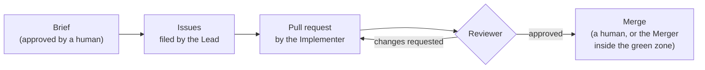

# Kanon

[](https://github.com/yedeya-labs/kanon/actions/workflows/ci.yml)
[](https://github.com/yedeya-labs/kanon/releases)
[](LICENSE)

**An opinionated agentic development workflow for GitHub and Claude Code.** AI agents file, implement and review the work on your repository, under rules that fail the build, not settings that can be switched off.

> **κανών** (*kanōn*): a measuring rod; the rule that work is checked against.

## Why Kanon

Running AI agents in GitHub Actions is a solved problem. What isn't solved is everything around it: what an agent may decide on its own, what counts as done, who has the last word, and how you find out when it went wrong. Kanon is that governance, written down and enforced.

- **Specs as acceptance criteria.** Behaviour is stated once, as a numbered invariant, and every issue's acceptance criteria cite it. "Done" means those invariants pass, not that an agent says so.
- **Review until approval, then a human merges.** An adversarial reviewer agent reviews every PR until it approves. An agent only merges inside a narrow green zone the project defines, and anything on an escalation path always goes to a human.
- **One taxonomy for work.** Labels, severities and milestone kinds are fixed, with a clear line between what an agent may decide and what a human must.
- **Cost and signal discipline.** Anything that raises cloud spend is discussed before it is incurred, and every operational signal has a recorded decision.
- **Guards on everything above,** including guards on the guards: a check that cannot fail is treated as a bug.

## How it works



A human approves a **brief** that decides and decomposes a piece of work. The agents take it from there, and the rulebook decides at every step what they may do.

## Opinionated on purpose

**Kanon has no configuration.** You adopt it by accepting its rules. When a rule doesn't fit your project, one of two things is true: the rule is wrong for everyone and Kanon changes it, or your project is outside what Kanon is for. Either way the answer is recorded, never worked around with a setting. That is what lets Kanon's checks mean the same thing in every repository ([ADR 0002](docs/decisions/0002-standardise-dont-parameterise.md)).

## Getting started

1. **Read [who Kanon is for](rulebook/00-principles.md).** It assumes a GitHub account (personal or organisation), Claude Code, and a test suite the agents can run.
2. **Follow the [adoption checklist](rulebook/10-adoption.md)**, which takes a new repository from its first commit through the bootstrap phase.
3. **Use Kanon's code by reference, pinned to an exact version,** and let Dependabot propose upgrades ([`K-ADOPT-11`](rulebook/10-adoption.md)):

<!-- x-release-please-start-version -->

| What | Use it as |
|---|---|
| [PR-title check](actions/pr-title/README.md) | `uses: yedeya-labs/kanon/actions/pr-title@v0.32.0` |
| [DCO sign-off check](actions/dco/README.md) | `uses: yedeya-labs/kanon/actions/dco@v0.32.0` |
| [Release workflow](docs/release.md) | `uses: yedeya-labs/kanon/.github/workflows/release.yml@v0.32.0` |
| [Agent lane: set up](actions/agent-setup/README.md) | `uses: yedeya-labs/kanon/actions/agent-setup@v0.32.0` |
| [Agent lane: run the agent](actions/agent-run/README.md) | `uses: yedeya-labs/kanon/actions/agent-run@v0.32.0` |
| [Agent lane: finish](actions/agent-finish/README.md) | `uses: yedeya-labs/kanon/actions/agent-finish@v0.32.0` |
| [Agent lane: classify a red run](actions/agent-classify/README.md) | `uses: yedeya-labs/kanon/actions/agent-classify@v0.32.0` |
| [Agent telemetry](actions/agent-telemetry/README.md) | `uses: yedeya-labs/kanon/actions/agent-telemetry@v0.32.0` |
| [Agent lanes: review, triage, implement, implement-revise, lead, lead-revise, lead-reconcile, lead-split, merge, merge-reconcile, rebase, verify-acs, project-digest, weekly-digest, explore, dispatch-sweep, code-audit, overseer](docs/lanes.md) | `uses: yedeya-labs/kanon/.github/workflows/agent-<lane>.yml@v0.32.0` in a job |
| [Lane check](actions/lane-check/README.md) | `uses: yedeya-labs/kanon/actions/lane-check@v0.32.0` |
| [Kanon's scripts from a workflow step](actions/kanon-path/README.md) | `uses: yedeya-labs/kanon/actions/kanon-path@v0.32.0` |

<!-- x-release-please-end -->

**Or let `kanon init` do the installation** ([plan 0005](docs/plans/0005-lean-installation.md) §5.4). Run from your repository's checkout, it inspects the repository and its owner, asks what it can't infer (the people, the stack's gates, the test database, a sign-off delegation, the lanes), each with a default, and writes only the declarations that differ from their documented defaults, the lane callers, the `apps-check` caller, `lane-check` in CI and the Dependabot entry, all pinned to the release it runs from. It creates the taxonomy's labels, the bucket milestones and, where the plan has rulesets and your token can administer the repository, the default branch's ruleset, then runs `kanon apps --apps` for the Apps the lanes run as, the Author and the Judge, and the optional Releaser if you call Kanon's release workflow and ask for it. A repository joining Apps the owner already has gets the `kanon apps --reuse` step instead. It commits nothing, prints as exact steps whatever your token or plan can't do, and changes nothing on a second run. A program can drive it too: a flag answers each question, and `--json` prints the result as a versioned JSON document ([docs/init.md](docs/init.md)). `--dry-run` shows it all first:

<!-- x-release-please-start-version -->

```sh
npx --yes --package github:yedeya-labs/kanon#v0.32.0 kanon init --dry-run
```

<!-- x-release-please-end -->

Each release also ships [`requirements.json`](requirements.json): what its lanes need of an adopter (secrets, the caller's grant, the documents and workflows they read, the hooks they call, the Apps they run as), built from the lanes and held to them by a test.

**Or let your agent do it, with Kanon's skills for Claude Code** ([docs/skills.md](docs/skills.md)). `/kanon:adopt` runs `kanon init` for you: a dry run first, each choice explained and asked, the files written on a branch, and each step only you can take (clicking **Create** and **Install** for the Apps, typing a secret) walked through, then the pull request, which you merge. `/kanon:doctor` checks an installation and fixes what it can, and `/kanon:upgrade` moves your pins to a new release. Install them as a plugin, pinned to the same release as everything else:

<!-- x-release-please-start-version -->

```sh
claude plugin marketplace add yedeya-labs/kanon#v0.32.0
claude plugin install kanon@kanon
```

<!-- x-release-please-end -->

Or declare the plugin in the repository, in `.claude/settings.json`, which `kanon init` offers to write: everyone who uses Claude Code there then gets the skills at that release, moving to a new one is one edit, and `kanon doctor` says when it differs from your callers' pin ([docs/skills.md](docs/skills.md#declare-it-in-the-repository)).

**Before you move the pin, run [`kanon doctor`](docs/doctor.md)** (plan 0005 §5.5). From the checkout, `kanon doctor --to <release>` compares your installation with that release's requirements file and lists what it needs, in the order to do it, each with its exact fix: an App permission to widen, a declaration to add, a caller's grant or secret to change. It also lists every job of your workflows that holds `id-token: write`, which the QA store's role and the telemetry writer admit. It writes nothing, and `--json` prints the same result as a versioned document for scripts and agents.

**Create the bucket milestones with `kanon milestones`** (step 7 of the checklist). It creates *Product Backlog* and *Development Automation*, with no due date, when no milestone has that name, and reports one that has a due date or is closed without changing it. Running it again creates nothing:

<!-- x-release-please-start-version -->

```sh
npx --yes --package github:yedeya-labs/kanon#v0.32.0 kanon milestones --repo <owner>/<repo>
```

<!-- x-release-please-end -->

**Create the Apps with [`kanon apps`](docs/apps.md)** (step 12 of the checklist): two per owner, reused across its repositories, the **Author** (Implementer, Lead, Explorer, Overseer) and the **Judge** (Reviewer, Merger), and the optional **Releaser** for releases. It builds each App from a manifest with exactly its permissions, stores its id and key as Actions secrets with your own `gh`, and writes one App register row per role. You click **Create** and **Install** in GitHub for each App; the command never creates one itself. The owner may be a personal account or an organisation; the command asks GitHub which, and refuses to run anywhere but your repository's checkout. Run it straight from a Kanon release tag, inside that checkout:

<!-- x-release-please-start-version -->

```sh
npx --yes --package github:yedeya-labs/kanon#v0.32.0 kanon apps --owner <owner> --repo <repo> --apps author,judge
```

<!-- x-release-please-end -->

Every lane in [`docs/lanes.md`](docs/lanes.md) ships at this version ([plan 0001](docs/plans/0001-move-the-agent-lanes.md), steps 1 to 5). **Start with the review lane:** it is the first an adopter installs, because its App is what ends bootstrap (`K-ADOPT-6`), on a plan with rulesets (`K-ADOPT-3`). [`docs/lanes.md`](docs/lanes.md#your-first-lane-the-reviewer) walks through it. The Explorer's sweep (explore), the dispatch sweep, the code audit and the optional Overseer reach their memory through the QA store contract ([`docs/qa-store.md`](docs/qa-store.md)); the dispatch sweep reads run artifacts without a store. That completes the store-coupled lanes ([plan 0004](docs/plans/0004-move-the-remaining-lanes.md)).

## Status

**Pre-1.0, used in production by its reference adopter.**

- **Complete:** the [rulebook](rulebook/), about 200 rules, each with its reason.
- **Released:** the checks and the release workflow above.
- **Running on Kanon itself:** the Reviewer reviews Kanon's own pull requests, through the review lane at Kanon's last release, never the PR's own copy ([ADR 0011](docs/decisions/0011-kanon-runs-its-own-lanes.md)). It reviews members' PRs labelled `review:please`, and the Owner merges. The Implementer's lanes and the Explorer's audit of Kanon's own code are called the same way.
- **Released lanes:** those of the Lead, the Implementer, the Reviewer, and the Explorer's acceptance-criteria check and sweep, listed in [`docs/lanes.md`](docs/lanes.md).
- **Being extracted:** the Merger's lane and the other non-model lanes, then the store-coupled lanes (explore, overseer, code-audit and the digests), which move with the telemetry store. They are *moved* from the reference adopter unchanged, not rewritten ([ADR 0009](docs/decisions/0009-move-dont-rewrite.md)), so the loop you adopt is the one already running in production.

See the [roadmap](ROADMAP.md) for what comes next.

## Repository layout

| Path | What |
|---|---|
| [`rulebook/`](rulebook/) | The rules. This is Kanon's specification. |
| [`docs/decisions/`](docs/decisions/) | Architecture decision records: why Kanon is shaped the way it is. |
| [`cli/`](cli/) | The `kanon` command: [`kanon init`](docs/init.md), [`kanon doctor`](docs/doctor.md), `kanon milestones` and [`kanon apps`](docs/apps.md). |
| [`skills/`](skills/) | The agent skills, adopt, doctor and upgrade, shipped as the `kanon` Claude Code plugin from [`.claude-plugin/`](.claude-plugin/) ([docs/skills.md](docs/skills.md)). |
| [`actions/`](actions/) | Kanon's checks, the lane check and the agent-lane blocks, each a versioned composite action. |
| [`scripts/`](scripts/) | The pipeline library: the scripts the lanes run, through [`kanon-path`](actions/kanon-path/README.md). |
| [`.github/workflows/`](.github/workflows/) | Kanon's agent lanes and the shared lane workflow they call, the reusable release workflow, and Kanon's own CI, including smoke runs of the blocks and the lanes. |
| [`tests/`](tests/) | Kanon's own tests, run on every pull request. |

## Contributing

Contributions are welcome, and every commit must be signed off by its human author. AI-assisted changes are fine, but a person certifies them. See [CONTRIBUTING.md](CONTRIBUTING.md), and please follow the [code of conduct](CODE_OF_CONDUCT.md). Report security problems privately, as described in [SECURITY.md](SECURITY.md).

## License

Kanon is licensed under the [Apache License 2.0](LICENSE). The name "Kanon" is not covered by the licence; see [TRADEMARK.md](TRADEMARK.md).
